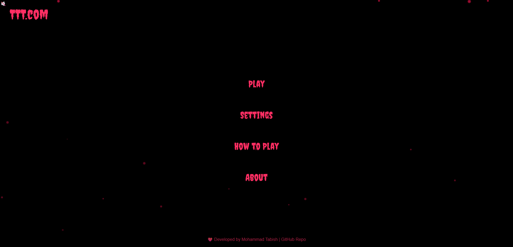

# 🎮 Tic Tac Toe Game

A simple and fun **Tic Tac Toe** game built using **HTML, CSS, and JavaScript** with custom styles and sound effects. Play as X or O, enjoy turn-based gameplay, and get a celebration on win!

---

## 💡 Features

- 🔁 Turn-based gameplay (X and O)
- 🎉 Win animation and celebration GIF
- 🔊 Sound effects for moves and game over
- 🔄 Reset button to start fresh anytime
- 💻 Responsive design for desktops and tablets
- ✨ Stylish custom font and glowing line on win

---

## 📁 Project Structure

TicTacToe/
│
├── assets/
│ ├── Demented-Nightmare-MP3(cho... # Background music
│ ├── gameover.mp3 # Game over sound
│ ├── ting.mp3 # Player move sound
│ └── s1.png # Screenshot / visual asset
│
├── css/
│ ├── game.css # Game-specific styles
│ └── style.css # General styles
│
├── game.html # Game board interface
├── index.html # Landing / main menu page
├── script.js # Main game logic

---

## 🚀 Getting Started

1. Clone or download the repository.
2. Open `index.html` in your browser to start playing.

---

## 👩‍💻 Technologies Used

- HTML5
- CSS3
- JavaScript (ES6)

---

## 📬 Feedback & Contributions

Feel free to fork this repo, raise issues, or submit pull requests. Your feedback is welcome!

---

👨‍💻 Developed By
Mohammad Tabish Farhan
🔗 https://github.com/tabishfarhan7

📜 License
This project is licensed under the MIT License.
Feel free to use and modify it for educational or personal use.
